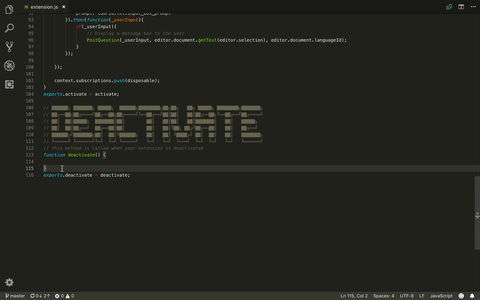

# Hey

Hey allows you to ask code-related questions by selecting code right from your IDE.

## Install

Visual Studio Code: https://marketplace.visualstudio.com/items?itemName=hey.vscode

Atom: https://atom.io/packages/hey

## Join the community

Want to contribute, help or ask questions?

https://t.me/heysociety

## Read more about the project
https://manifesto.hey.network
